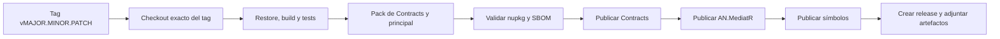

# Workflow de publicación de paquetes NuGet

## Propósito

Este documento describe el proceso operativo para liberar `AN.MediatR`, `AN.MediatR.Contracts` y `AN.MediatR.Extensions.Autofac.DependencyInjection` como paquetes NuGet. Cubre el versionado desde Git, validación, empaquetado, publicación y comprobaciones posteriores.

El repositorio usa [MinVer](https://github.com/adamralph/minver) para derivar versiones de los tags Git. No hay una propiedad `Version` fija en los proyectos actuales: el tag y el historial son la fuente de verdad. La fecha de publicación no define la versión.

> La publicación es irreversible para una versión concreta en NuGet.org. Un paquete ya publicado no se debe reemplazar ni reutilizar con otro contenido. Completar todas las comprobaciones antes de crear y subir el tag de release.

## Paquetes que se generan

| Proyecto | Paquete esperado | Frameworks |
|---|---|---|
| `src/AN.MediatR.Contracts/AN.MediatR.Contracts.csproj` | `AN.MediatR.Contracts.<versión>.nupkg` | `netstandard2.0` |
| `src/AN.MediatR/AN.MediatR.csproj` | `AN.MediatR.<versión>.nupkg` | `netstandard2.0`, `net8.0`, `net9.0`, `net10.0` y `net462` en Windows |
| `src/AN.MediatR.Extensions.Autofac.DependencyInjection/AN.MediatR.Extensions.Autofac.DependencyInjection.csproj` | `AN.MediatR.Extensions.Autofac.DependencyInjection.<versión>.nupkg` | `netstandard2.0` |

Los tres proyectos generan también un paquete de símbolos `.snupkg`. El paquete principal tiene una referencia de proyecto hacia `AN.MediatR.Contracts`; al empaquetarlo debe aparecer una dependencia NuGet hacia la versión publicada de contratos. Los tags anteriores a la incorporación de Autofac sólo generan y publican los paquetes que existían en ese tag; para publicar la integración se debe crear una nueva release taggeada que la contenga.

## Estado actual y ajustes necesarios antes de la primera publicación

El repositorio contiene scripts y workflows heredados que son una buena base, pero no constituyen todavía un flujo de publicación seguro para el fork. Antes de habilitar una release automática deben resolverse estos puntos:

| Elemento actual | Riesgo o incoherencia | Ajuste requerido |
|---|---|---|
| `Build.ps1` | Correctamente empaqueta los tres proyectos, pero elimina `artifacts/` al iniciar. | Ejecutarlo sólo en un árbol donde se puedan regenerar los artefactos. |
| `Push.ps1` | Publica todos los `*.nupkg` en el orden que devuelva el sistema, no sube `*.snupkg` y no usa `--skip-duplicate`. | Publicar contratos antes que el paquete principal; añadir manejo explícito de símbolos y de duplicados o publicar los ficheros de forma manual y ordenada. |
| CI actual | Se activa sobre `master`, instala sólo SDK 6/8 y publica en un feed MyGet heredado. | Usar la rama principal real (`main`, salvo decisión distinta), SDKs 8/9/10 y ningún feed o secreto ajeno al fork. |
| Release actual | Se dispara con cualquier tag que tenga dos puntos, mientras MinVer exige prefijo `v`. | Disparar sólo con tags `v*.*.*` o validar estrictamente el formato antes de publicar. |
| `AN.MediatR.snk` | Firma los ensamblados, no el paquete NuGet. | Decidir por separado si se requiere firma de paquetes y configurar un certificado/servicio propio. |
| Metadatos legales | Los `.csproj` declaran Apache-2.0, mientras la actualización desde upstream posterior tiene una decisión de procedencia pendiente. | No publicar hasta cerrar la revisión legal indicada en `19 - Plan_de_actualizacion_del_upstream_sin_licenciamiento.md`. |

## 1. Política de versión y tags

### Formato obligatorio

Usar tags anotados con el formato:

```text
v<MAJOR>.<MINOR>.<PATCH>
```

Ejemplos válidos:

```text
v2026.0.0
v2026.0.1
v2026.1.0
v2027.0.0
```

El prefijo `v` es necesario porque ambos `.csproj` contienen:

```xml
<MinVerTagPrefix>v</MinVerTagPrefix>
```

En el commit que recibe `v2026.1.0`, MinVer produce `2026.1.0` para los tres paquetes. Un commit posterior sin tag recibe una versión de prerelease calculada por MinVer, no una nueva versión estable. Las versiones exactas se deben comprobar, nunca deducir a ojo, con:

```powershell
dotnet msbuild src/AN.MediatR/AN.MediatR.csproj -getProperty:PackageVersion
dotnet msbuild src/AN.MediatR.Contracts/AN.MediatR.Contracts.csproj -getProperty:PackageVersion
dotnet msbuild src/AN.MediatR.Extensions.Autofac.DependencyInjection/AN.MediatR.Extensions.Autofac.DependencyInjection.csproj -getProperty:PackageVersion
```

Para candidatos previos, usar un tag SemVer de prerelease, por ejemplo `v2026.1.0-rc.1`, y publicar primero en un feed de pruebas o como prerelease en NuGet.org. No publicar una versión estable sólo para comprobar el pipeline.

### Cuándo incrementar cada componente

| Cambio | Incremento recomendado |
|---|---|
| Corrección compatible, documentación o CI | `PATCH` |
| Nueva funcionalidad compatible o mejora del upstream | `MINOR` |
| Cambio incompatible de API, de namespace, TFM o comportamiento | `MAJOR` |

Como el fork ya usa namespaces e IDs `AN.MediatR`, su versión debe seguir su propia política SemVer. No se debe reutilizar un número publicado por `MediatR`; `AN.MediatR` es un paquete distinto.

## 2. Requisitos y configuración de secretos

### Herramientas locales

- Git con acceso de escritura al remoto del fork.
- SDKs de .NET 8, 9 y 10. En Windows se debe poder compilar también `net462`.
- PowerShell 7 o Windows PowerShell para los scripts `.ps1`.
- Una API key con permiso de publicación para el propietario de los paquetes `AN.MediatR` y `AN.MediatR.Contracts`.

### Variables de publicación

`Push.ps1` consume estas variables de entorno:

| Variable | Ejemplo | Uso |
|---|---|---|
| `NUGET_URL` | `https://api.nuget.org/v3/index.json` | Endpoint del feed de destino. |
| `NUGET_API_KEY` | Nunca guardar su valor en Git | Credencial para `dotnet nuget push`. |

En GitHub Actions deben guardarse como secretos o variables de entorno del repositorio/entorno de release. No imprimirlas, no incluirlas en logs y no reutilizar secretos, feeds, identidades de SBOM o certificados del upstream.

Se recomienda crear un entorno protegido de GitHub llamado, por ejemplo, `nuget-production`, con aprobación manual y acceso limitado a los mantenedores de release.

## 3. Flujo de release, de principio a fin

### Paso 0 — Autorizar la release

Antes de preparar un tag, confirmar:

1. La revisión legal y de procedencia está cerrada.
2. La rama principal contiene los cambios aprobados y no hay modificaciones locales no confirmadas.
3. La versión propuesta no está ya publicada en NuGet.org.
4. El README, metadatos de paquete, icono, licencia y URLs representan al fork.
5. Las notas de release enumeran cambios, incompatibilidades y pasos de migración si los hay.

### Paso 1 — Preparar la rama

Partir de la rama principal sincronizada. Ejemplo para la próxima versión `2026.0.1`:

```powershell
git checkout main
git pull --ff-only origin main
git status --short
git log --oneline -20
git tag --list "v2026.0.1"
```

El estado debe estar limpio y el último comando no debe devolver un tag existente. Si hay cambios pendientes, detenerse: un tag no debe apuntar a una combinación accidental de cambios.

### Paso 2 — Confirmar la versión calculada

Antes de taggear, MinVer mostrará normalmente una versión de prerelease para el commit posterior al último tag. Después de crear el tag, la versión estable será el número sin la `v`.

Puede verificarse el resultado final en un clon temporal o crear el tag localmente, comprobar y borrar el tag sólo si todavía no se ha enviado al remoto:

```powershell
git tag -a v2026.0.1 -m "Release AN.MediatR 2026.0.1"
dotnet msbuild src/AN.MediatR/AN.MediatR.csproj -getProperty:PackageVersion
dotnet msbuild src/AN.MediatR.Contracts/AN.MediatR.Contracts.csproj -getProperty:PackageVersion
dotnet msbuild src/AN.MediatR.Extensions.Autofac.DependencyInjection/AN.MediatR.Extensions.Autofac.DependencyInjection.csproj -getProperty:PackageVersion
```

Ambas consultas deben devolver `2026.0.1`. Si no lo hacen, borrar sólo el tag local recién creado (`git tag -d v2026.0.1`), corregir la configuración y repetir. No enviar el tag hasta pasar la validación.

### Paso 3 — Restaurar, compilar y probar

Ejecutar el pipeline local de release. `Build.ps1` limpia `artifacts/`, compila la solución, ejecuta los tests y empaqueta los tres proyectos:

```powershell
./Build.ps1
```

Equivale, en lo esencial, a:

```powershell
dotnet clean -c Release
dotnet build -c Release
dotnet test -c Release --no-build -l trx --verbosity=normal
dotnet pack src/AN.MediatR/AN.MediatR.csproj -c Release -o artifacts --no-build
dotnet pack src/AN.MediatR.Contracts/AN.MediatR.Contracts.csproj -c Release -o artifacts --no-build
dotnet pack src/AN.MediatR.Extensions.Autofac.DependencyInjection/AN.MediatR.Extensions.Autofac.DependencyInjection.csproj -c Release -o artifacts --no-build
```

El build debe ejecutarse en Windows antes de la publicación de producción, ya que sólo allí se compila el target `net462`. Si el workflow de release usa otro sistema operativo, esa variante no queda validada.

Cuando el proyecto de pruebas de integración de contenedores esté incorporado, ejecutar además de forma explícita:

```powershell
dotnet test test/AN.MediatR.DependencyInjectionTests/AN.MediatR.DependencyInjectionTests.csproj -c Release --no-build
```

### Paso 4 — Inspeccionar los artefactos

La carpeta `artifacts/` debe contener, como mínimo:

```text
AN.MediatR.Contracts.2026.0.1.nupkg
AN.MediatR.Contracts.2026.0.1.snupkg
AN.MediatR.2026.0.1.nupkg
AN.MediatR.2026.0.1.snupkg
AN.MediatR.Extensions.Autofac.DependencyInjection.2026.0.1.nupkg
AN.MediatR.Extensions.Autofac.DependencyInjection.2026.0.1.snupkg
```

Validar antes de publicar:

1. Los seis nombres usan la misma versión y los IDs `AN.*`.
2. Los `.nupkg` incluyen README, icono, licencia/metadatos aprobados, XML de documentación y los TFMs esperados.
3. El `.nuspec` de `AN.MediatR` declara una dependencia a `AN.MediatR.Contracts` de la versión correcta, no a `MediatR.Contracts`.
4. No aparecen dependencias de activación de licencia como `Microsoft.IdentityModel.JsonWebTokens`.
5. Los resultados `.trx` no contienen pruebas fallidas, omitidas inesperadamente ni rutas con secretos.

La inspección puede hacerse abriendo el `.nupkg` como ZIP o instalándolo desde una fuente local en un proyecto consumidor mínimo. Esta última comprobación debe restaurar tanto el paquete principal como el de contratos desde `artifacts/` y compilar un `IRequest<T>` con un `IRequestHandler<,>`.

### Paso 5 — Publicar en un feed de prueba (recomendado)

Para una nueva versión, primero publicar el prerelease en un feed interno o instalarla desde `artifacts/` en una aplicación de muestra. No usar NuGet.org como entorno de ensayo.

Publicar siempre en este orden:

1. `AN.MediatR.Contracts`.
2. `AN.MediatR`.
3. `AN.MediatR.Extensions.Autofac.DependencyInjection`.
4. Los símbolos `.snupkg` de los tres paquetes, si el feed los admite.

El orden evita una ventana en la que el paquete principal esté disponible y su versión de contratos todavía no pueda restaurarse.

### Paso 6 — Enviar el tag y ejecutar el workflow de release

Cuando la validación local o de preproducción sea satisfactoria, enviar el tag anotado:

```powershell
git push origin v2026.0.1
```

El workflow de release debe activarse exclusivamente por ese tag. Su secuencia recomendada es:



El workflow debe fallar antes de cualquier publicación si falla una prueba, el tag no coincide con el formato permitido o la versión de los paquetes no coincide con el tag.

### Paso 7 — Publicar manualmente sólo si el workflow no lo hace

Si la publicación se realiza desde una estación de trabajo autorizada, definir las variables sólo para la sesión actual y subir los paquetes en orden. No registrar la clave en el perfil de PowerShell ni en un archivo del repositorio.

```powershell
$env:NUGET_URL = "https://api.nuget.org/v3/index.json"
$env:NUGET_API_KEY = "<API_KEY_DE_NUGET>"

dotnet nuget push .\artifacts\AN.MediatR.Contracts.2026.0.1.nupkg --source $env:NUGET_URL --api-key $env:NUGET_API_KEY --skip-duplicate
dotnet nuget push .\artifacts\AN.MediatR.2026.0.1.nupkg --source $env:NUGET_URL --api-key $env:NUGET_API_KEY --skip-duplicate
dotnet nuget push .\artifacts\AN.MediatR.Extensions.Autofac.DependencyInjection.2026.0.1.nupkg --source $env:NUGET_URL --api-key $env:NUGET_API_KEY --skip-duplicate
dotnet nuget push .\artifacts\AN.MediatR.Contracts.2026.0.1.snupkg --source $env:NUGET_URL --api-key $env:NUGET_API_KEY --skip-duplicate
dotnet nuget push .\artifacts\AN.MediatR.2026.0.1.snupkg --source $env:NUGET_URL --api-key $env:NUGET_API_KEY --skip-duplicate
dotnet nuget push .\artifacts\AN.MediatR.Extensions.Autofac.DependencyInjection.2026.0.1.snupkg --source $env:NUGET_URL --api-key $env:NUGET_API_KEY --skip-duplicate
```

Usar `--skip-duplicate` permite reintentar una ejecución interrumpida, pero no es una forma de sustituir un paquete existente. Si una versión ya existe, comparar el hash y detenerse si no corresponde al artefacto de la release actual.

`Push.ps1` se puede usar tras modificarlo para reflejar este orden y los símbolos. `Publish.ps1` valida y copia los seis artefactos desde el tag estable, pero por defecto sólo valida y requiere `-Publish` para copiar a la carpeta UNC.

### Paso 8 — Verificar la publicación

Después de que el feed procese los paquetes:

1. Comprobar en NuGet.org que aparecen ambos IDs, la versión, icono, README, licencia y enlaces correctos.
2. Crear un proyecto consumidor vacío y restaurar exactamente `AN.MediatR` en la versión liberada desde NuGet.org.
3. Compilar y ejecutar una petición/handler y una notificación simples.
4. Comprobar la descarga de símbolos y Source Link, si se han publicado `.snupkg`.
5. Crear las notas/release de GitHub que apunten al tag y adjuntar `.nupkg`, `.snupkg`, SBOM y resultados relevantes si esa es la política del repositorio.
6. Anotar la URL de la release y la versión publicada en el registro de cambios.

Si se detecta un defecto después de publicar, no reemplazar el paquete: publicar un incremento `PATCH` nuevo, deprecar la versión afectada en NuGet.org si procede y documentar la corrección.

## 4. Diseño recomendado para GitHub Actions

Separar CI y publicación evita que una pull request publique accidentalmente un paquete:

| Evento | Permisos | Qué debe hacer | Qué no debe hacer |
|---|---|---|---|
| Pull request | `contents: read` | Restore, build, tests, `pack`, subir artefactos y `.trx` | Publicar, acceder a secretos de producción o crear tags. |
| Push a `main` | `contents: read` | Igual que PR; opcionalmente publicar prereleases en un feed propio de desarrollo. | Publicar versiones estables en NuGet.org. |
| Tag `v*.*.*` | `contents: read` y permisos limitados del entorno de release | Recompilar desde el tag, validar, generar SBOM, publicar y crear release. | Usar feeds, secretos o identidades del upstream. |

El runner de release recomendado es Windows con los SDKs 8/9/10 instalados, porque asegura también la compilación condicional de `net462`. El checkout debe tener `fetch-depth: 0` para que MinVer vea los tags.

El workflow debería comprobar la versión con una condición equivalente a:

```text
tag = v2026.0.1  →  PackageVersion = 2026.0.1
```

Si no coincide, la ejecución debe terminar antes del paso de `nuget push`.

## 5. Responsabilidades de los scripts actuales

| Script | Uso correcto | Limitaciones actuales |
|---|---|---|
| `Build.ps1` | Pipeline local completo: limpiar, compilar, probar y empaquetar los tres paquetes. | Borra `artifacts/`; no inspecciona contenido ni publica símbolos. |
| `BuildContracts.ps1` | Construir y empaquetar sólo contratos, con `ContinuousIntegrationBuild=true`. | No sustituye al build completo ni valida el paquete principal. |
| `Push.ps1` | Base para un push autenticado usando `NUGET_URL` y `NUGET_API_KEY`. | Sin orden de dependencias, sin `.snupkg`, sin `--skip-duplicate` y con mensaje de error heredado que debe revisarse. |
| `Publish.ps1` | Release segura desde el último tag estable alcanzable: crea un worktree temporal en el tag, ejecuta `Build.ps1`, valida los seis artefactos, comprueba que MinVer coincide con el tag y los copia en orden a la carpeta UNC. | Por defecto sólo valida. Requiere `-Publish` y una ruta UNC real; el valor por defecto `\\<server>\nuget` es un marcador que debe sustituirse. |
| `devserver-publish.ps1` | Wrapper para publicar en el recurso compartido NuGet de un servidor. | Requiere `-Server` con una dirección IPv4 y construye `\\<server>\nuget`. |

La mejora mínima recomendada para `Push.ps1` es recibir una versión o rutas explícitas, validar que existen los cuatro artefactos esperados, subir contratos antes que el principal y tratar los símbolos por separado. Esa modificación debe acompañarse de tests o una ejecución contra un feed de pruebas.

Para un feed de carpeta compartida, el uso previsto del nuevo script es:

```powershell
# Validación completa del último tag, sin publicar.
.\Publish.ps1 -NuGetSource "\\<server>\nuget"

# Publicación automática en el recurso compartido NuGet del servidor indicado.
.\devserver-publish.ps1 -Server <IPv4-address>

# Validar el wrapper sin copiar paquetes.
.\devserver-publish.ps1 -Server <IPv4-address> -WhatIf
```

Para una carpeta compartida, `Publish.ps1` copia directamente los seis artefactos
(`.nupkg` y `.snupkg`) en la ruta UNC. Si un archivo con el mismo nombre ya existe,
lo omite cuando su hash coincide o cuando el contenido interno del paquete es equivalente
y sólo difieren metadatos del archivo ZIP; nunca sobrescribe un paquete diferente.

## 6. Lista de control de aprobación

Antes de pulsar la aprobación del entorno de producción, una persona distinta de quien preparó el tag debería comprobar:

- [ ] El tag es anotado, tiene formato `vMAJOR.MINOR.PATCH` y apunta al commit revisado.
- [ ] MinVer produce la versión prevista para los tres proyectos.
- [ ] El árbol de origen y el commit de release están identificados en las notas.
- [ ] Build, tests y pruebas de integración DI han pasado en Windows.
- [ ] Se han inspeccionado los tres `.nupkg` y sus tres `.snupkg`.
- [ ] `AN.MediatR` depende de `AN.MediatR.Contracts`, no de paquetes `MediatR` upstream.
- [ ] No hay runtime licensing, claves, JWT ni dependencias prohibidas en los paquetes.
- [ ] La declaración legal y los metadatos del paquete han sido aprobados.
- [ ] La API key tiene el mínimo alcance y procede del entorno de producción propio.
- [ ] Se publicarán Contracts, el paquete principal y la integración Autofac en ese orden.
- [ ] Existe un plan para verificar instalación desde NuGet.org y publicar las notas de release.

## 7. Recuperación ante fallos

| Situación | Acción |
|---|---|
| Fallan build o tests antes del push | Corregir en una nueva rama/commit; no mover ni recrear un tag remoto ya publicado. |
| Falla la subida de Contracts | No subir el paquete principal. Corregir credenciales/feed y reintentar la misma subida sólo si el paquete no se publicó. |
| Contracts se publicó y falla el principal | Confirmar hash y presencia de Contracts; corregir la automatización y reintentar el principal con la misma versión únicamente si no llegó a publicarse. |
| El principal se publicó con un defecto | Publicar un `PATCH` nuevo. No intentar sobrescribir la versión. |
| Se publicó el tag pero el workflow no se inició | Investigar el filtro del workflow y ejecutarlo manualmente sobre el mismo tag si el proceso está diseñado para ello; no crear un segundo tag con la misma versión. |
| Se filtró una API key | Revocarla inmediatamente en el proveedor, sustituir el secreto y revisar logs/historial. |

## Relación con el plan de actualización

Este workflow presupone que se han completado las fases de solución, pruebas, empaquetado, CI y revisión legal del documento [19 - Plan de actualización desde el upstream sin licenciamiento](19%20-%20Plan_de_actualizacion_del_upstream_sin_licenciamiento.md). La automatización de publicación debe implementarse después de que la paridad funcional y la ausencia de licenciamiento en ejecución estén verificadas.
